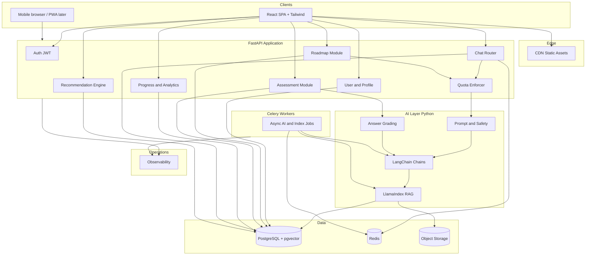
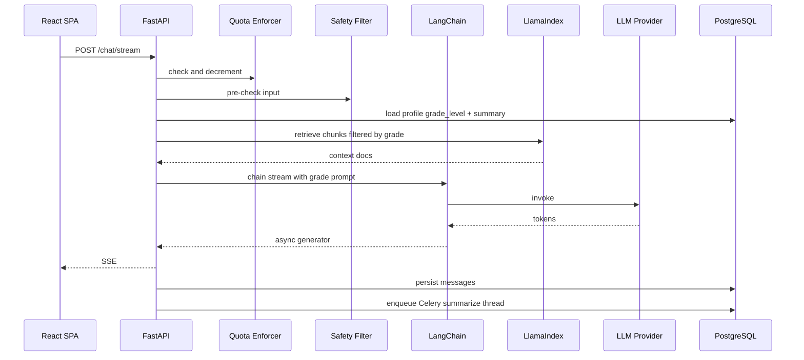
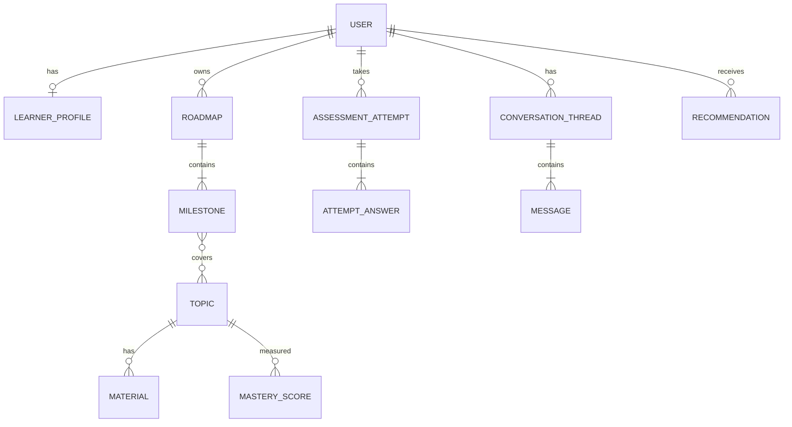
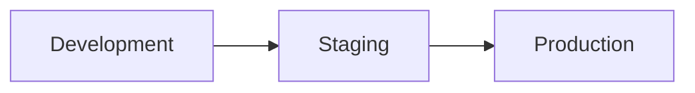

# Buddio — Technical Architecture

**Versi:** 1.1  
**Tanggal:** 27 Juli 2026  
**Status:** Perencanaan (stack: React + FastAPI + PostgreSQL + LangChain/LlamaIndex)

---

## 1. Prinsip arsitektur

1. **Backend Python terpusat** — FastAPI modular; AI (LangChain/LlamaIndex) di same service atau worker Celery.
2. **Frontend React SPA** — Tailwind; komunikasi REST + SSE; tidak ada BFF Next.js.
3. **AI as a pluggable layer** — Abstraksi provider LLM; prompt per **jenjang user** terpusat.
4. **Event-friendly** — Domain events internal (assessment.completed, roadmap.updated) untuk analitik dan job async.
5. **Privacy by design** — PII terpisah logika; retention policy per tipe data.
6. **Quota-first** — Semua endpoint AI melewati enforce quota sebelum invoke chain.

---

## 2. Diagram konteks sistem

---

## 3. Komponen utama

### 3.1 Client layer (React + Tailwind)

| Komponen | Tanggung jawab |
|----------|-----------------|
| **React SPA (Vite)** | Dashboard, chat mentor, roadmap, insights, settings — **copy Bahasa Indonesia** |
| **Tailwind + komponen UI** | shadcn/ui atau setara; aksesibilitas dasar |

State: **TanStack Query** untuk API; state lokal untuk streaming chat (SSE).

### 3.2 FastAPI API layer

- **OpenAPI** (`/docs`) sebagai kontrak frontend.
- JWT access + refresh; CORS ke origin SPA.
- **Quota dependency** inject ke router `/ai/*` dan generate roadmap/quiz.
- Aggregasi endpoint home feed (opsional) untuk kurangi round-trip.
- **SSE** (`StreamingResponse`) untuk token stream chat LangChain.

### 3.3 Domain modules (FastAPI packages)

| Modul | Entitas utama | Operasi kunci |
|-------|---------------|---------------|
| **Identity** | User, session, role | Register, login, OAuth, delete account |
| **Profile** | LearnerProfile, goals, **gradeLevel** (user-selected) | CRUD profil, ganti jenjang (dengan konfirmasi) |
| **Quota** | UsageLedger, daily limits | Check, decrement, expose sisa ke client |
| **Roadmap** | Roadmap, Milestone, Template | Generate, edit, progress sync |
| **Learning content** | Material, Topic, CurriculumTag | CRUD materi, tagging |
| **Assessment** | Quiz, Question, Attempt | Create attempt, submit, score |
| **Competency** | SkillNode, MasteryScore | Update dari assessment + rules |
| **Recommendation** | RecommendationItem | Generate dari mastery + roadmap state |
| **Conversation** | Thread, Message, Summary | Chat history, rolling summary untuk context window |

### 3.4 AI layer (LangChain + LlamaIndex)

**LangChain** tanggung jawab:

- Chat chain streaming dengan memory + **system prompt jenjang** (`sd` … `self_learner`).
- Structured output roadmap/quiz (Pydantic parser).
- Tool calling: `get_roadmap`, `get_mastery` (fase lanjut).

**LlamaIndex** tanggung jawab:

- Index materi internal, template per jenjang, FAQ Buddio.
- Retrieval dengan metadata filter: `grade_level`, `subject`.

**Grading pipeline (assessment):**

- MCQ: deterministic di Python.
- Short answer: LangChain rubric chain + confidence; flag review jika rendah.

### 3.5 Recommendation engine (v1 rule-based + skor)

Input:

- Mastery scores per topic
- Roadmap position & overdue milestones
- Recent chat topics (extracted keywords)

Output:

- Prioritized list: `review_topic`, `practice_set`, `mentor_session`, `read_material`

v2: collaborative filtering / bandit untuk urutan rekomendasi (opsional).

---

## 4. Model data (konseptual)

**Catatan penyimpanan chat:**

- Pesan full disimpan terenkripsi at rest (field-level optional untuk MVP).
- **Rolling summary** per thread untuk konteks LLM (update async setelah N pesan).

---

## 5. Integrasi eksternal

| Integrasi | Use case |
|-----------|----------|
| **OAuth** (Google, Apple) | Login cepat |
| **Email provider** | Magic link, notifikasi |
| **LLM API** | Primary + fallback |
| **Payment** (later) | Top-up quota / subscription setelah PMF |
| **Analytics** | Product analytics (PostHog / Amplitude) |

---

## 6. Keamanan

| Area | Implementasi |
|------|----------------|
| AuthN/Z | OAuth2 + session; RBAC: learner, parent (later), admin |
| API | HTTPS only, CORS ketat, CSRF untuk cookie session |
| Secrets | Vault / env managed; rotasi key |
| AI abuse | Rate limit, prompt injection hardening, output filter |
| Data | Soft delete + hard delete pipeline untuk GDPR/PDP |
| Audit | Admin actions & export data logged |

---

## 7. Skalabilitas & performa

| Concern | Strategi |
|---------|----------|
| Chat load | Horizontal scale stateless API; sticky optional untuk WS |
| LLM cost | Cache FAQ, summarize history, smaller model untuk triage |
| DB | Read replica saat traffic naik; index pada userId, threadId |
| Heavy jobs | **Celery**: roadmap generation, summarization, LlamaIndex ingest |
| Static assets | CDN global |

---

## 8. Deployment & environment

- **IaC:** Terraform atau Pulumi (satu cloud primary, mis. AWS atau GCP).
- **Container:** Docker Compose (dev); production Docker + Railway/Fly/ECS.
- **CI/CD:** PR checks (lint, test, build); deploy staging otomatis; prod manual approval.
- **Feature flags:** LaunchDarkly / open source untuk rollout AI prompt versions.

---

## 9. Observability

- **Metrics:** latency API, token usage, error rate LLM, queue depth.
- **Tracing:** OpenTelemetry end-to-end (request → LLM call).
- **Logging:** Structured JSON; no PII in logs.
- **Alerting:** SLO breach, budget LLM harian, failed jobs.

---

## 10. Disaster recovery & backup

- PostgreSQL: automated daily backup, PITR target RPO < 24 jam (MVP).
- Object storage: versioning untuk materi.
- Runbook: failover LLM provider, read-only mode jika AI down.

---

## 11. Evolusi arsitektur (future)

| Trigger | Evolusi |
|---------|---------|
| Tim > 8 engineer | Pisah AI worker service |
| Real-time collaboration | WebRTC / CRDT service terpisah |
| Enterprise sekolah | Multi-tenant + SSO SAML |
| Offline mobile | Sync engine + local SQLite |

---

## 11.1 Frontend Route Structure

/

/login

/register

/onboarding

/dashboard

/dashboard/subjects

/dashboard/subjects/:id

/dashboard/profile

/settings

## 11.2 Frontend Layout

Layout dibagi menjadi beberapa area:

Landing Layout

Authentication Layout

Dashboard Layout

Learning Workspace Layout

Setiap layout memiliki navigasi dan komponen yang berbeda agar pengalaman pengguna lebih konsisten.

*Arsitektur ini selaras dengan PRD Buddio dan dirancang untuk MVP yang dapat di-scale tanpa rewrite total.*
